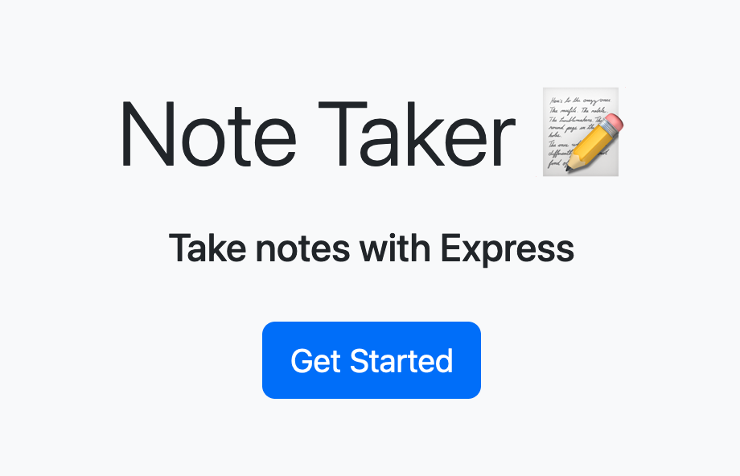

# Note Taker

## Description

The purpose of this project was to build an Express-based application where users can take notes. In this application, users can create, save and delete notes all from one page.

## Usage

Users can follow the link to the deployed webpage to access the note taker application. Click the blue "Get Started" button to get to the notes page. Users can create a title for the note and then enter the note text below. When the note is complete, click the save icon on the top right corner of the page. The note will be saved on the left side of the page. To delete a note, click on the red trash can icon next to the note. 

### Webpage Link

https://note-taker-ba.herokuapp.com/

### Webpage Screenshot

## Credits

This challenge was completed in collaboration with the instructional staff (Diarmuid Murphy), TA (Meg Meyers) and classmates in the February 2023 UCLA Extension Coding Boot Camp.

## License

MIT License

Copyright (c) 2023 Brian Autieri

Permission is hereby granted, free of charge, to any person obtaining a copy of this software and associated documentation files (the "Software"), to deal in the Software without restriction, including without limitation the rights to use, copy, modify, merge, publish, distribute, sublicense, and/or sell copies of the Software, and to permit persons to whom the Software is furnished to do so, subject to the following conditions:

The above copyright notice and this permission notice shall be included in all copies or substantial portions of the Software.

THE SOFTWARE IS PROVIDED "AS IS", WITHOUT WARRANTY OF ANY KIND, EXPRESS OR IMPLIED, INCLUDING BUT NOT LIMITED TO THE WARRANTIES OF MERCHANTABILITY, FITNESS FOR A PARTICULAR PURPOSE AND NONINFRINGEMENT. IN NO EVENT SHALL THE AUTHORS OR COPYRIGHT HOLDERS BE LIABLE FOR ANY CLAIM, DAMAGES OR OTHER LIABILITY, WHETHER IN AN ACTION OF CONTRACT, TORT OR OTHERWISE, ARISING FROM, OUT OF OR IN CONNECTION WITH THE SOFTWARE OR THE USE OR OTHER DEALINGS IN THE SOFTWARE.
